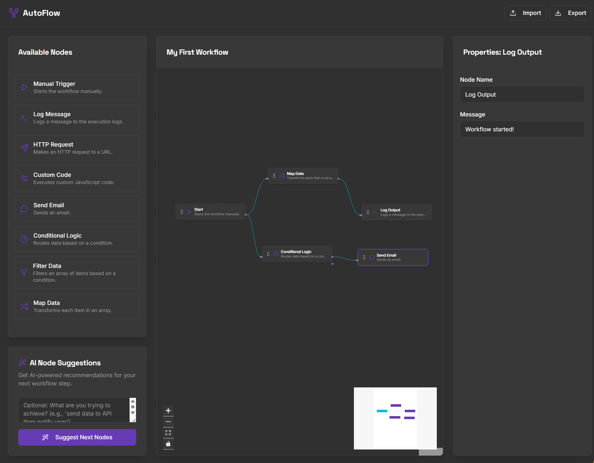

# AutoFlow

AutoFlow is a web application that allows users to design and visualize workflows with the help of AI suggestions.

## Deployment

This project can be deployed using App Hosting. The `apphosting.yaml` file provides the necessary configuration.

### Self-Hosting Deployment

To self-host AutoFlow, you will need Node.js and npm installed.

1. **Clone the repository:**

## Usage

1. Access the deployed application through your web browser.
2. Use the intuitive interface to drag and drop nodes and connect them to build your workflow.
3. Leverage the AI suggestion feature to get recommendations for the next steps in your workflow.

## Visual Overview

Here is a visual representation of AutoFlow:

